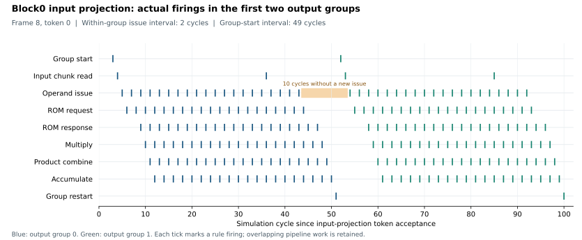

# Sway

Compact selective state-space model accelerator research for ECP5-class FPGAs.

## MARS software

`sw/` implements, trains, evaluates, quantizes, and exports a MARS human-pose regression model reconstructed from the published [eMamba configuration](https://arxiv.org/html/2508.10370v1). It uses D=20, E=2, P=2, M=2, N=8, 16 spatial tokens, range normalization, and ReLU for the selective step size. Exact SiLU and exponential functions are used in training; piecewise approximations are evaluated separately.

This is our reimplementation, not an author checkpoint. The paper omits the regression head, several block details, training recipe, and approximation coefficients. Our choices are explicit in [model.json](sw/config/model.json). The implemented model has 15,717 trainable parameters, so it is not a parameter-exact recovery of the reported model.

The [official MARS arrays](https://github.com/SizheAn/MARS/tree/dc902822f864ca0d5df90d559d53d3cd919d3c7c/feature) contain 24,066 training, 8,033 validation, and 7,984 test frames. We preserve these memberships. Their approximately 60/20/20 split differs from eMamba's stated 64/16/20 proportions. Inputs are 8×8×5; outputs are 19 X coordinates, 19 Y coordinates, and 19 Z coordinates, in metres. Reported centimetre RMSE averages 57 coordinatewise RMSE values, following the original MARS evaluation code; pooled RMSE is also recorded.

## Run

Python 3.10 or newer and CPU or CUDA PyTorch are required. From the repository root:

```sh
python -m pip install -r sw/requirements.txt
python sw/prepare_data.py --data-dir ../data/mars --download
python sw/check.py
python sw/train.py --data ../data/mars --output sw/results/my_run --epochs 150 --batch-size 256 --threads 2
python sw/evaluate.py --data ../data/mars --checkpoint sw/results/my_run/best.pt --output sw/results/my_run/evaluation --quantize
```

Training uses MSE, AdamW (learning rate 0.001, weight decay 0.0001), gradient clipping at 1, validation-based learning-rate reduction, and early stopping after 25 epochs without improvement. These are our training settings. The default seed is 20260917. The test split is excluded from fitting, calibration, learning-rate decisions, and checkpoint selection. Resume within the same output directory using `--resume sw/results/my_run/last.pt` and a larger `--epochs` limit.

Quantization uses symmetric INT8 values and power-of-two scales calibrated on 2,048 training frames. Two clipping policies (99.9th percentile and maximum) are compared on validation data before final test evaluation. The affine/convolution reference uses integer accumulators; the SSM uses INT24 current state and INT17 retained state. Normalization, nonlinearities, and remaining elementwise operations use quantize/dequantize simulation. These results validate the software numerical model, not complete integer RTL equivalence.

## Outputs

- `best.pt`, `last.pt`: validation-selected and resumable FP32 checkpoints.
- `history.csv`, `run.json`: epoch measurements, configuration, dataset hashes, software versions, and runtime.
- `evaluation/metrics.json`: FP32, piecewise FP32, and post-training quantized test metrics.
- `evaluation/calibration.json`: train-only quantization scales.
- `evaluation/export/`: parameter arrays, hexadecimal and binary files, and layout/scale metadata for a later RTL implementation.
- [data_manifest.json](sw/results/data_manifest.json): pinned source revision, file hashes, dimensions, and split differences.

No FPGA latency, utilization, power, or board result is claimed by this software experiment.

## Measured run

[Run 20260917](sw/results/mars_seed20260917/run.json) trained for 150 epochs on CPU with two PyTorch threads (942.26 seconds). Validation selected epoch 148, with coordinatewise mean RMSE 8.9315 cm. The epoch limit was reached; convergence is not claimed. Training history and checkpoints are included.

The following results use all 7,984 official test frames and the same selected checkpoint. Quantization scales use 2,048 training frames; validation selected maximum-based calibration over the 99.9th-percentile alternative.

| Software numerical model | MAE (cm) | Mean coordinatewise RMSE (cm) |
|---|---:|---:|
| FP32, exact nonlinear functions | 6.6485 | 8.9582 |
| FP32, our piecewise nonlinear functions | 7.3938 | 9.6793 |
| INT8 PTQ, our piecewise nonlinear functions | 7.9799 | 10.4598 |

[Detailed metrics](sw/results/mars_seed20260917/evaluation/metrics.json) include axis errors, pooled RMSE, validation-only calibration selection, and state saturation counts. [Exports](sw/results/mars_seed20260917/evaluation/export/manifest.json) contain 15,717 INT8 parameter bytes, excluding scale metadata and state storage. [Numerical checks](sw/results/verification.json) and [artifact checks](sw/results/mars_seed20260917/evaluation/artifact_verification.json) passed.

The eMamba paper reports FP32/INT8 RMSE of 7.85/8.83 cm. Those are published reference values, not reproduced here. Our model details, split membership and PWL coefficients differ as described above, so this run does not establish a matched reproduction of that accuracy or a hardware comparison.

## MARS hardware baseline

`hw/` implements the complete fixed-weight MARS inference graph in Bluespec: patch embedding, two selective-SSM blocks, and the regression head. It retains separate layer engines and token pipelining through FIFOs. Affine engines have four output lanes; normalization, depthwise convolution, and gating use two lanes; the scan processes two states of one channel per issue. Affine weights use four initialized ROM banks per layer. Two frame RAM banks feed the patch serializer; each block's recurrent state uses two 160×17 RAM banks. This is our ECP5-folded baseline, not the eMamba authors' RTL.

The kernel uses the existing trained INT8 weights and calibration scales. Normalization computes an exact rational result with ties-to-even rounding; SiLU and exponential ROMs enumerate the existing quantized piecewise functions. Each frame starts with zero convolution history and zero SSM state. Current state is signed INT24; its output is computed before arithmetic right-shifting by seven bits into signed INT17 storage.

Operand selection, ROM reads, multiplication, accumulation, bias addition, and requantization have explicit register boundaries. Affine input selection uses 16-element chunks, and sequential ROM addresses avoid address multipliers. Coefficient banks use native ECP5 BRAM output registers, with reserved response slots to preserve requests during backpressure. Multipliers use registered partial products mapped to LUTs through the standard Yosys `-nodsp` option. Nonlinear lookups register sixteen candidates selected by the low address nibble before the high nibble selects the final byte. Normalization separates channel statistics, bounded partial products, 26-bit restoring division, and rounding decisions. Intermediate widths follow the fixed model's arithmetic bounds; saturation and ties-to-even rounding retain the integer reference's results.

The regression head receives tokens into two frame stores spread across sixteen byte RAM banks, avoiding a simultaneous 320-byte register load. Registered write commands isolate RAM write enables from frame-control logic; a frame becomes available only after its final write commits. Engine control and FIFO state use separate, preserved two-flop reset branches from the same synchronized root. Data registers initialize at transaction start or before their first valid use. Reset branches use ordinary fabric routing and remain visible to timing analysis; inputs wait for their branch's release. BSC reports G0043 at some interfaces because it sees distinct reset objects; the branches share the same clock, root and release depth. The [reset regression](hw/results/reset.json) checks the RTL primitive and Bluesim models' matching behavior.

After synthesis, `physical-netlist` duplicates combinational clock-enable drivers into groups of at most 64 connections. Each duplicated LUT5 mux receives its own LUT4 pair. An independent structural audit checks that every original state and I/O endpoint retains the same logic function, while preserving register state, clock connections and timing constraints. The [replication manifest](hw/results/control_replication.json) and [audit](hw/results/control_replication_audit.json) record the changes and both netlist hashes. Placement and routing consume the audited netlist.

Build with [blueyosys](https://github.com/SeMinLim/blueyosys/tree/3ea0afea56c7c73b8ed59ec0edd256c409466788), BSC/Bluesim and the ECP5 OSS CAD tools on `PATH`. The Makefile directly includes blueyosys `build.mk`; the default checkout location is a sibling of `sway`. Checked-in ROMs and test vectors allow simulation without downloading the dataset or running training.

```sh
make -C hw runsim BLUEYOSYS=/absolute/path/to/blueyosys
make -C hw runsim SIM_BACKEND=iverilog BLUEYOSYS=/absolute/path/to/blueyosys
make -C hw check-verilator BLUEYOSYS=/absolute/path/to/blueyosys
make -C hw check-reset BLUEYOSYS=/absolute/path/to/blueyosys
make -C hw verilog BLUEYOSYS=/absolute/path/to/blueyosys
make -C hw netlist BLUEYOSYS=/absolute/path/to/blueyosys
make -C hw pnr BLUEYOSYS=/absolute/path/to/blueyosys
make -C hw synth BLUEYOSYS=/absolute/path/to/blueyosys
```

The local Makefile selects nextpnr's `router1` with timing-driven ripup (`--tmg-ripup`). `synth` finishes only after routing, bitstream packing, and the timing gate pass. The gate requires the actual PLL-derived 100 MHz core constraint and 25 MHz UART constraint, checks every reported clock against its constraint, and rejects incomplete routing or timing failures. It saves the clock results and artifact hashes in `hw/results/timing.json`.

`mkSwayBaseline` accepts 320 signed INT8 values per frame in HWC order, scaled by 2^-2, and returns 57 signed INT8 coordinates, ordered X19/Y19/Z19 and scaled by 2^-5 metres. The ULX3S wrapper uses 115200-baud UART with raw input/output bytes; send one frame and read its complete reply before sending another. It synchronizes reset release in both clock domains and corrects the pinned blueyosys PLL reset polarity locally. UART transfer time is outside kernel measurements.

[The integer reference report](hw/generated/reference_report.json) records an RMSE of 10.4589 cm on all 7,984 test frames. Replacing only the software model's float32 normalization with this rational definition makes all 455,088 outputs match the integer reference. The original software QDQ graph is not bit-identical: its RMSE is 10.4598 cm, with at most three output LSBs difference. Hardware simulation results are separate from this full-dataset software evaluation.

[Bluesim](hw/results/bluesim.json), [generated-Verilog/Icarus](hw/results/iverilog.json), and [Verilator](hw/results/verilator.json) each pass all 798 output comparisons over the same 14 frames against the integer reference. All three produce identical output values and event cycles, completing at cycle 240,833. Fixtures include real data, zero and extreme inputs, and repeated frames; the test applies input bubbles and an 8,192-cycle output stall per frame. Its cycle totals include those deliberate stalls and are not kernel throughput measurements. Icarus and Verilator exercise the native coefficient BVI with an explicit two-cycle behavioral ROM model; a separate [netlist audit](hw/results/native_rom.json) checks all 44 physical ROM banks, initialization contents, and port configuration. Verilator uses two-state simulation; Icarus retains four-state verification. The build uses BSC 2026.01 and Yosys 0.69+75; source hashes and FPGA build results are recorded in [validation.json](hw/results/validation.json).

Completed ULX3S-85F placement and routing use 44,898 TRELLIS_COMB cells, 46,451 FFs, 49 BRAMs, and no DSP multipliers. [Post-route static timing analysis](hw/results/timing.json) reports 101.49 MHz for the core (100 MHz constraint: PASS) and 108.97 MHz for UART (25 MHz constraint: PASS). The [complete nextpnr log](hw/results/nextpnr.log) and [packed bitstream](hw/results/sway_mars_ulx3s85f.bit) are included. This establishes post-route timing closure for the configured clocks; no physical-board test was performed.

To regenerate checkpoint ROMs, test fixtures, and the numerical report using the software Python dependencies:

```sh
python hw/reference/generate.py --data ../data/mars
```

## Kernel performance test

```sh
make -C hw perf BLUEYOSYS=/absolute/path/to/blueyosys
make -C hw perf SIM_BACKEND=iverilog BLUEYOSYS=/absolute/path/to/blueyosys
make -C hw check-perf-parser BLUEYOSYS=/absolute/path/to/blueyosys
```

`TbSwayPerf.bsv` directly drives the unchanged `mkSwayBaseline`, not the UART wrapper. Separate simulations measure one isolated frame and a continuous 64-frame stream, cycling through the checked-in fixtures. The source attempts one input byte each cycle; the sink attempts one output each cycle. Only DUT readiness introduces stalls. Every output is checked against the integer reference; watchdog and trailing-output checks remain active. No training or dataset download is required.

Logs and `summary.json` are generated in `hw/results/perf/<backend>/`; builds use `hw/perf/<backend>/`. Existing stress tests, logs, synthesis settings, and weights are unchanged. Single-frame latency is the last output cycle minus the first accepted input cycle. Throughput uses completion intervals between frames 8 and 55 (47 intervals), reports min/mean/max and variation, and does not assume those intervals have converged. Input acceptance, internal stalls, and 57-byte output serialization are included; reset, UART, host processing, and the final 2,048-cycle drain are excluded. Time and frames/s use the configured 100 MHz from `timing.json`, not its 101.49 MHz timing limit, and are derived from simulation rather than board measurements.

Measured with BSC/Bluesim 2026.01 and the pinned blueyosys revision above:

| Kernel metric | Simulation cycles | Derived time at 100 MHz |
|---|---:|---:|
| Isolated frame latency, first accepted input to 57th output | 25,249 | 252.49 µs |
| Continuous frame completion interval | 15,792 | 157.92 µs/frame |

The resulting kernel throughput is `100,000,000 / 15,792 = 6,332.32 frames/s`. The isolated run uses fixture 0; the 64-frame run cycles through all 14 checked-in fixtures. All 57 isolated outputs and 3,648 stream outputs match the integer reference. The selected 47 intervals have identical minimum, mean, and maximum values; all 63 observed stream intervals are also 15,792 cycles. These are simulation measurements and configured-clock conversions, not physical-board measurements.

[The measured summary](hw/results/perf/bluesim/summary.json), [isolated-frame log](hw/results/perf/bluesim/single.log), and [64-frame log](hw/results/perf/bluesim/stream.log) retain transaction cycles and source/fixture hashes. The checker also passes its 18 synthetic-transcript unit tests. The performance Icarus target invokes `vvp` from `PATH`, including when Icarus is installed outside `/usr/bin`.

## Pipeline boundary profile

```sh
make -C hw profile BLUEYOSYS=/absolute/path/to/blueyosys
make -C hw check-profile-parser BLUEYOSYS=/absolute/path/to/blueyosys
```

`profile` reuses the unstalled 64-frame performance driver and enables `SWAY_PROFILE` only in its separate simulation build. The existing forwarding rules record `boundary,frame,token,cycle` when a transfer succeeds: patch creation, embedding input, Block0 input, Block1 input, hidden-head input, output-head input, and serializer input. Each boundary has its own frame counter; token positions remain 0–15, while each head result has index 0 once per frame. The profiling clock shares the testbench's reset origin. No engine internals, functional FIFOs, arithmetic, weights, or board-build flags are changed.

The reference is the uninstrumented performance run at `cb97a81aaae04c14a96f5cb7b1c27d040193b9b9`. Its log and compiler schedule are checked in. `perf-stream` also saves its schedule for subsequent comparisons. For another simulator or a changed baseline, run `perf-stream` with the same settings before `profile`; the checker requires matching reference logs and schedules. This profile result uses BSC/Bluesim 2026.01 and blueyosys `3ea0afea56c7c73b8ed59ec0edd256c409466788`.

**The first persistent widening to 987 cycles/token is observed at Block0's output.** Startup distinguishes this from upstream throttling: embedding initially delivers tokens to Block0 every 252 cycles, whereas Block0 delivers its first and subsequent tokens every 987 cycles. Block1 preserves that spacing.

| Boundary | Frame 0, token 0 cycle | Token 1 cycle | Token 2 cycle | Steady token interval (cycles) |
|---|---:|---:|---:|---:|
| Embedding → Block0 | 601 | 853 | 1,105 | 987 |
| Block0 → Block1 | 3,477 | 4,464 | 5,451 | 987 |
| Block1 → hidden head | 6,353 | 7,340 | 8,327 | 987 |

In frames 8–55, every token boundary, including patch creation and embedding input, has identical min/mean/max spacing of 987 cycles. The head results and kernel completions remain 15,792 cycles apart, equal to `16 × 987`; the downstream boundaries show no additional spacing increase. Block0 is therefore the first limiting candidate identified by these boundary records. A forwarding event requires both producer output and consumer readiness, so this does not establish Block0 as the unique bottleneck, identify an internal engine, or measure Block1's independent maximum rate.

The paired transaction spans below are constant in frames 8–55. Token rows contain 768 pairs each; frame rows contain 48 pairs each.

| Measured span | Unit | Cycles |
|---|---|---:|
| Patch ready → embedding acceptance | Token | 986 |
| Embedding acceptance → Block0 acceptance | Token | 1,972 |
| Block0 acceptance → Block1 acceptance | Token | 4,935 |
| Block1 acceptance → hidden-head acceptance | Token | 2,876 |
| Hidden head, first-token acceptance → result transfer | Frame | 18,098 |
| Hidden head, last-token acceptance → result transfer | Frame | 3,293 |
| Output-head acceptance → serializer acceptance | Frame | 742 |
| Serializer acceptance → final scalar reception | Frame | 58 |

These spans include queues and downstream backpressure; they are not pure computation times and must not be added as a kernel latency breakdown. The hidden-head first-token span includes `15 × 987 = 14,805` cycles collecting tokens. Its 18,098-cycle span is therefore not a frame service interval. Block0's first token takes 2,876 cycles from acceptance to delivery, compared with 4,935 under saturation; choosing the largest residence alone would confuse accumulated waiting with processing cost.

All 3,648 scalar outputs match the integer reference, all 5,248 boundary records pass ordering and causality checks, and every original performance record, including input/output cycles, matches the uninstrumented run. Compiler schedule comparison preserves the predicates, blockers, and relative execution order of all 490 original rules; only the independent profiling tick is added. The profile checker passes 12 tests covering corrupt records, changed cycles, missing transactions, causality, stale reports, and schedule changes. These are simulation observations, not board measurements.

[Summary](hw/results/profile/bluesim/summary.json), [raw boundary log](hw/results/profile/bluesim/stream.log), and [paired stage cycles](hw/results/profile/bluesim/stages.csv) retain all measurements and source hashes. The [reference schedule](hw/results/perf/bluesim/stream.sched) and [profile schedule](hw/results/profile/bluesim/stream.sched) retain the scheduling evidence.

## Block0 internal profile

**Block0's 20→80 input projection sets the observed 987-cycle token acceptance interval.** Its four output lanes process 20 output groups, each requiring 20 operand issues. The trace identifies two costs: alternate-cycle issue through ordinary one-entry FIFOs, and draining the last product before starting the next output group. Input starvation and downstream output waiting do not extend this interval in the measured run. The kernel frame interval remains `16 × 987 = 15,792` cycles.

```sh
make -C hw block-profile BLUEYOSYS=/absolute/path/to/blueyosys
make -C hw check-block-profile-parser BLUEYOSYS=/absolute/path/to/blueyosys
# Optional figure regeneration; requires matplotlib.
(cd hw && python3 reference/plot_block_profile.py)
```

`block-profile` reuses the same unstalled 64-frame driver, with `SWAY_PROFILE` and `SWAY_BLOCK_PROFILE` enabled only in a separate simulation build. Its reference is the boundary profile at `618034a6e70761bac378942cc133dfd771c8ef61`. Run `perf-stream` and `profile` first when changing the baseline or simulator. This result uses BSC/Bluesim 2026.01 and the pinned blueyosys revision above.

Only Block0 receives new internal observations. Existing transfer rules record its normalization, input projection, convolution, state projection, delta projection, selective scan, gating, output projection, and residual boundaries. The normalization output enqueue distinguishes result readiness from downstream acceptance. Within the input projection, each existing rule updates its own simulation counter when it fires. Token lifecycle events and per-token firing counts cover all 1,024 tokens; detailed rule timestamps cover frame 8, token 0. Functional guards, FIFO types and depths, arithmetic, weights, and board-build flags are unchanged.

The following accepted-to-transferred spans are constant for frames 8–55, with 768 token pairs per row. They include queue effects and are not independent engine service intervals.

| Block0 span | Cycles |
|---|---:|
| Block input acceptance → normalization acceptance | 986 |
| Normalization acceptance → output enqueue | 493 |
| Normalization output enqueue → input-projection acceptance | 986 |
| Input-projection acceptance → result transfer | 987 |
| Convolution start → activated output enqueue | 51 |
| State-projection acceptance → delta-projection acceptance | 452 |
| Delta-projection acceptance → scan acceptance | 137 |
| Scan acceptance → gating acceptance | 343 |
| Gating acceptance → output-projection acceptance | 44 |
| Output-projection acceptance → residual acceptance | 452 |
| Residual acceptance → Block0 output enqueue | 1 |
| Block0 output enqueue → Block1 acceptance | 1 |

Two additional one-cycle handoffs connect the input-projection result to convolution start, and the activated convolution output to state-projection acceptance. Normalization's 493-cycle span can include a blocked output queue; it is not a pure normalization compute time. The long input and normalization waits are consistent with backpressure from input projection. Stage residence alone is not the bottleneck test.

For every subsequent token, its normalized input is already ready before the preceding input-projection result is emitted: 582 cycles early for the first transition, then 985 cycles early for the remaining 1,022 transitions. The retained input FIFO accepts the next token exactly one cycle after that emit, its first available cycle. Every projection result is consumed one cycle after emit, on the same cycle the next token is accepted when one follows. Every Block0 output is also transferred to Block1 one cycle after enqueue. In the detailed sample, the final collect is followed by emit in one cycle. These observations locate the measured spacing inside the input-projection execution rather than in missing input or downstream output blockage.

The detailed sample accepts its token at cycle 127,343 and the next at 128,330. Taking the first acceptance as cycle zero:

- Output group 0 issues operands at cycles 5, 7, …, 43. Its last accumulation occurs at 50, restart at 51, the next group starts at 52, its input chunk loads at 53, and its first operand issues at 54. Successive groups' first issues are exactly 49 cycles apart.
- Each operand's issue → ROM request → response → multiply → combine → accumulation has observed delays of 1, 3, 1, 1, and 1 cycles. The 3-cycle request-to-response span is the interface observation, not a separate claim about physical BRAM latency.
- The last group issues its final operand at 974, accumulates it at 981, then bias/add/round/collect execute at 982/983/984/985. The result emits at 986; the next token is accepted at 987.



[`SwayLinear.bsv`](hw/bsv/SwayLinear.bsv) uses ordinary `mkFIFO1` queues for issue commands and the operand/product pipeline. A full one-entry queue cannot accept its replacement on the cycle it is dequeued, so issue and dispatch alternate. The trace confirms a two-cycle issue interval within each group. After the final issue, `process3Last` waits for the returned final product, then `process3Restart`, `process1Group`, and `process2Chunk` run before the next issue. The final issue of one group and the first of the next are 11 cycles apart, leaving ten intervening cycles without a new issue. Loading the second 16-element input chunk fits into the existing alternate-cycle gap and adds no extra issue gap in this sample.

The 987 cycle slots from this token's acceptance, inclusive, to the next acceptance, exclusive, partition exactly as follows:

| Cycle-slot category | Cycles |
|---|---:|
| Before the first operand issue | 5 |
| Operand issue firings, 20 inputs × 20 output groups | 400 |
| Nonissue slots within groups, 19 × 20 | 380 |
| Nonissue slots between groups, 10 × 19 | 190 |
| After the final issue through completion and input-slot release | 12 |
| **Total** | **987** |

The operand issue fraction is `400 / 987 = 40.53%`. Each issue supplies four output lanes, for 1,600 scalar products per token. This fraction describes this engine's issue slots, not FPGA utilization or total idle time: response, multiply, accumulation, and output work overlap some nonissue slots. All 1,024 tokens have 400 read, dispatch, response, multiply, and combine firings, plus 380 ordinary and 20 final accumulations, 20 group starts, and 40 chunk loads. The detailed trace accounts for the observed 987 cycles without an unexplained gap.

Validation passes all 3,648 integer-reference output comparisons, 13,312 internal boundary records, 5,120 token lifecycle records, 9,216 counter records, and 2,560 detailed rule events. Removing the new records reproduces every previous scalar and boundary transaction, including cycles, exactly. Compiler schedule comparison preserves the predicates, blockers, and relative execution order of all 491 pre-existing rules; only four unconditional observer clocks are added. The checker passes 11 focused tests for malformed or missing events, altered counters/cycles, causality, stale reports, and schedule changes.

This identifies the observed Block0 input-projection constraint in the current ECP5 implementation. It does not measure Block1's independent capacity or establish an intrinsic eMamba architecture limit. These are simulation measurements; no optimization or new board measurement is included.

[Summary](hw/results/block_profile/bluesim/summary.json), [raw log](hw/results/block_profile/bluesim/stream.log), [stage spans](hw/results/block_profile/bluesim/stages.csv), [detailed sample](hw/results/block_profile/bluesim/sample.csv), and [compiler schedule](hw/results/block_profile/bluesim/stream.sched) retain the evidence and source hashes. The [checker](hw/reference/check_block_profile.py) regenerates the numerical reports, and the [plot script](hw/reference/plot_block_profile.py) regenerates the figure from the validated sample.
